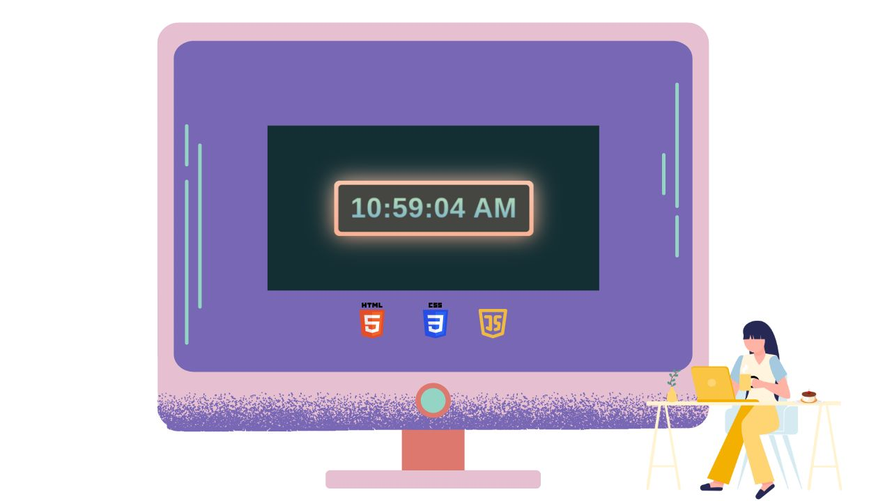

# Neon Clock

Neon Digital Clock that Disiplays Current time in a web page

---

## Project Overview
- Display clock in HTML with Javascript
- The time is displayed in hours, minutes, and seconds format
- The display distinguishes between AM and PM
- The time updates every second
- The time is displayed in a div element with the id of "time"
- The code uses JavaScript's setInterval method to update the time
- The code uses JavaScript's Date object to get the current time information
- The code formats the time information to display hours, minutes, and seconds with leading zeros if needed
- The code also calculates AM/PM based on the hours and updates the display accordingly.